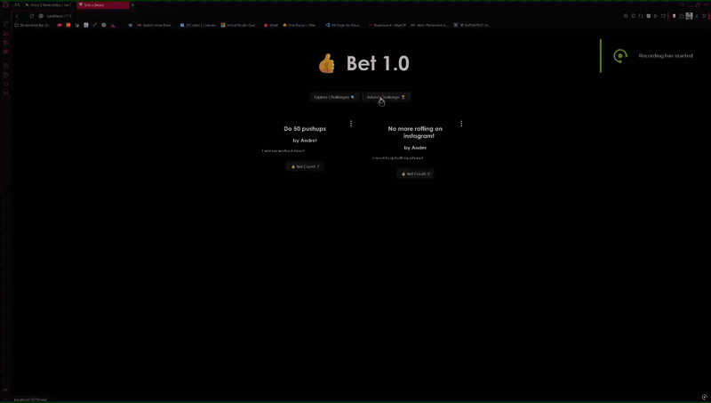

Web Development Lab 7 - Bet 1.0

Submitted by: Andre Rodriguez

This web app: allows users to create, read, update, and delete challenge posts using a Supabase database. Users can also interact with posts by increasing a bet count that is stored and persisted in the database.

Time spent: 3 hours spent in total

Required Features

The following required functionality is completed:

 [x] The user is able to perform all four CRUD operations
 [x] The user can create a new challenge
 [x] All submitted challenges can be read on the homepage
 [x] A challenge can be updated once it has been submitted
 [x] A challenge can be deleted once it has been submitted
Stretch Features

The following optional features are implemented:

 [x] The app keeps track of the bet count for each challenge
 [x] Users can click the bet button to increase the bet count
 [x] The bet count is saved and persists in the database after refresh
Video Walkthrough

Here's a walkthrough of implemented required features:

Notes

One challenge I faced was connecting the React app to Supabase and ensuring that all CRUD operations worked correctly. Debugging issues with inserting and updating data required careful checking of API keys, table names, and event handlers. Another challenge was making sure the bet count persisted correctly after refreshing the page, which required properly updating the database and syncing state.

License

Copyright 2026 Andre Rodriguez

Licensed under the Apache License, Version 2.0 (the "License");
you may not use this file except in compliance with the License.
You may obtain a copy of the License at

http://www.apache.org/licenses/LICENSE-2.0